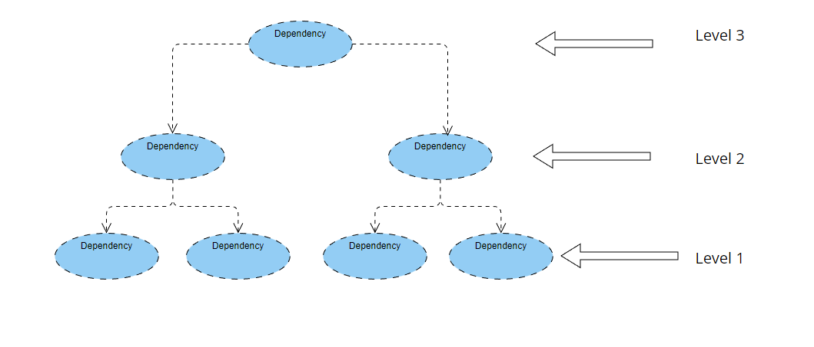



# DependencyLoader

DependencyLoader is a simple proof-of-concept project that demonstrates a way to level and load dependencies.

## Leveling Process

The leveling process is a way to determine the hierarchy of dependencies. Each dependency has a level property, which is set when it is added to another dependency. The root dependency has a level of 0, and each child dependency has a level one greater than its parent.

For example, if we have a root dependency `A` and it has two child dependencies `B` and `C`, then `B` and `C` would have a level of 1. If `B` has a child dependency `D`, then `D` would have a level of 2.

## Loading Process

The loading process in this project is done by calling the `Load` method on each dependency. The dependencies are grouped by their level, which is determined by the level of the dependency's parent.

The `Load` method is called asynchronously on each dependency in the group, using the `Task.WhenAll` method to wait for all of the tasks to complete before moving on to the next group. This ensures that all dependencies of a certain level are loaded before moving on to the next level.

It's worth noting that there is support for multi-threading using the `Parallel.ForEachAsync` method, but the results were worse when testing with fake data.